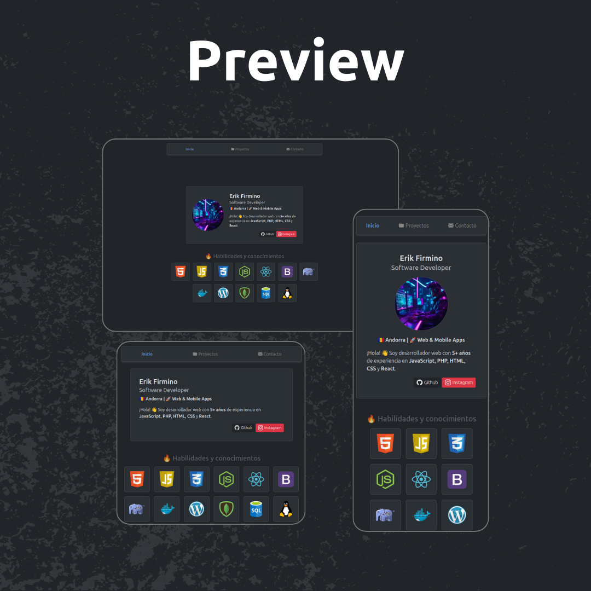

# 🌟 Portafolio de Erik Firmino

¡Bienvenido a mi portafolio personal! 🚀 Aquí podrás encontrar información sobre mí, mis habilidades y mis proyectos. Este sitio web es una representación de mi experiencia y pasión por el desarrollo de software.

## 🖼️ Vista Previa



## 🧑‍💻 Sobre mí

👋 Hola, soy **Erik Firmino**, un **Software Developer** con más de **5 años de experiencia** en tecnologías como **JavaScript, PHP, HTML, CSS y React**. Actualmente resido en **Andorra** y me especializo en la creación de aplicaciones web y móviles.

## 🛠️ Habilidades

Algunas de las tecnologías con las que trabajo:

- 🟧 **HTML**
- 🟨 **JavaScript**
- 🟦 **CSS**
- 🌐 **React**
- 🖥️ **Node.js**
- 🐘 **PHP**
- 🔧 **Docker**
- 📦 **SQL & MongoDB**
- 🎨 **Bootstrap**
- 🐧 **Linux**
- 🛠️ **WordPress**

## 🏗️ Estructura del Proyecto

El proyecto se divide en varias secciones clave:

1. **Inicio**: Carta de presentación con mi nombre, ocupación y breve resumen.  
2. **Habilidades**: Slider interactivo con mis principales tecnologías.  
3. **Proyectos** (pendiente): Espacio para destacar algunos de mis trabajos más importantes.  
4. **Contacto** (pendiente): Formulario y enlaces a redes sociales.

## 🚀 Tecnologías utilizadas

- **HTML5**  
- **CSS3**  
- **Bootstrap**  
- **JavaScript (ES6+)**  

## 📦 Instalación y uso

1. Clona este repositorio:
   ```bash
   git clone https://github.com/erikfirmino/portfolio.git
